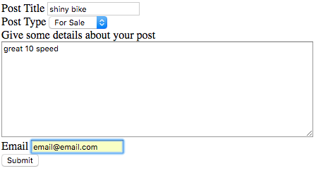

# New Craigslist

A distributed Craigslist-like Holochain app prototype developed during the Vancouver Holochain Hackathon!

## Getting Started

Follow the [Holochain Development](https://developer.holochain.org/Install_Holochain) instructions to install Holochain on your
machine.

Once it's installed, clone the repository `https://github.com/science-girl/NewCraigslist.git`
`cd NewCraigslist`
Run `hcdev web &` to launch an instance of the app on [localhost](localhost:4141)

If you want to develop the app further and have `fswatch` installed, you can run `fswatch ./ui | xargs -n1 './restart.sh'`
to update the site as you develop.

To run the unit tests, run `hcdev --no-nat-upnp test`

## Authors

Lindsey Woo and QingXin Yuan

## Acknowledgements

Thank you to Connor, Art, and all the organizers of the Holochain Hackathon!
